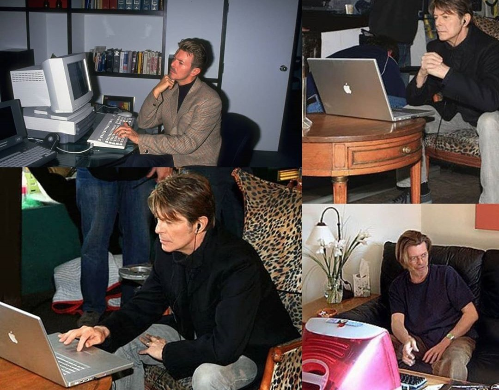

`bowie` inspired us! 👨‍🎤 👏👏👏👏👏

We started with this idea of creating a tool to standardize all the commands of the different projects in the [Gradiant](https://github.com/Gradiant) research center, through the development of the wonderful `bowie` package.
We know that the project is still active in several projects, so long live bowie and thanks to the Gradiant team for the initial impulse.